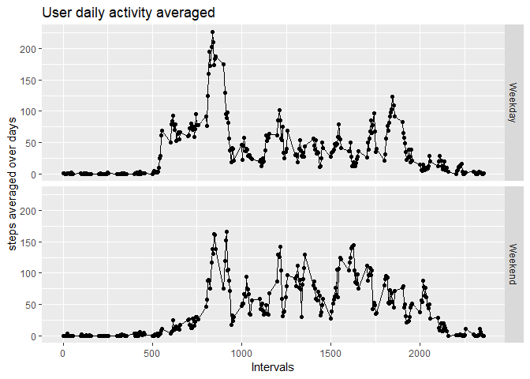

This report is about extracting data and generating plots on actively monitored data collected from users wearing devices such as Fitbit, Nuke Fuelband or JawboneUp or any other.

## Extracting & Looking at Data 
The data for the following study is available publicly [here](https://d396qusza40orc.cloudfront.net/repdata%2Fdata%2Factivity.zip).
After downloading and the extracting the .csv file in the RStudio's working directory, ```read.csv()``` can be used. Further, we can use ```head()``` command to have a look at the data, and ```str()``` to get dimensions, data type etc.

```r
studyData<-read.csv('activity.csv')
head(studyData)
```

```
##   steps       date interval
## 1    NA 2012-10-01        0
## 2    NA 2012-10-01        5
## 3    NA 2012-10-01       10
## 4    NA 2012-10-01       15
## 5    NA 2012-10-01       20
## 6    NA 2012-10-01       25
```

```r
str(studyData)
```

```
## 'data.frame':	17568 obs. of  3 variables:
##  $ steps   : int  NA NA NA NA NA NA NA NA NA NA ...
##  $ date    : Factor w/ 61 levels "2012-10-01","2012-10-02",..: 1 1 1 1 1 1 1 1 1 1 ...
##  $ interval: int  0 5 10 15 20 25 30 35 40 45 ...
```
The variables included in this dataset are:

- **steps**: Number of steps taking in a 5-minute interval (missing values are coded as NA)

- **date**: The date on which the measurement was taken in YYYY-MM-DD format

- **interval**: Identifier for the 5-minute interval in which measurement was taken

The dataset is stored in a comma-separated-value (CSV) file and there are a total of 17,568 observations in this dataset.

## What is mean total number of steps taken per day?
 *For this part of the assignment, you can ignore the missing values in the dataset.*

1. *Make a histogram of the total number of steps taken each day*

2. *Calculate and report the mean and median total number of steps taken per day*

For this case, we would need to first aggregate the total steps corresponding to every date, for which the function ```aggregate()``` is used. Then the function ```barplot()``` is used to plot the details. ```aggregate()``` can also be used to compute mean and median steps per day.


```r
totalSteps<-aggregate(steps~date,studyData,sum)
barplot(height = totalSteps$steps,names.arg = totalSteps$date,xlab="day",ylab = "total steps",main="total steps per day")
```

<!-- -->

```r
meanSteps<-aggregate(steps~date,studyData,mean)
meanSteps
```

```
##          date      steps
## 1  2012-10-02  0.4375000
## 2  2012-10-03 39.4166667
## 3  2012-10-04 42.0694444
## 4  2012-10-05 46.1597222
## 5  2012-10-06 53.5416667
## 6  2012-10-07 38.2465278
## 7  2012-10-09 44.4826389
## 8  2012-10-10 34.3750000
## 9  2012-10-11 35.7777778
## 10 2012-10-12 60.3541667
## 11 2012-10-13 43.1458333
## 12 2012-10-14 52.4236111
## 13 2012-10-15 35.2048611
## 14 2012-10-16 52.3750000
## 15 2012-10-17 46.7083333
## 16 2012-10-18 34.9166667
## 17 2012-10-19 41.0729167
## 18 2012-10-20 36.0937500
## 19 2012-10-21 30.6284722
## 20 2012-10-22 46.7361111
## 21 2012-10-23 30.9652778
## 22 2012-10-24 29.0104167
## 23 2012-10-25  8.6527778
## 24 2012-10-26 23.5347222
## 25 2012-10-27 35.1354167
## 26 2012-10-28 39.7847222
## 27 2012-10-29 17.4236111
## 28 2012-10-30 34.0937500
## 29 2012-10-31 53.5208333
## 30 2012-11-02 36.8055556
## 31 2012-11-03 36.7048611
## 32 2012-11-05 36.2465278
## 33 2012-11-06 28.9375000
## 34 2012-11-07 44.7326389
## 35 2012-11-08 11.1770833
## 36 2012-11-11 43.7777778
## 37 2012-11-12 37.3784722
## 38 2012-11-13 25.4722222
## 39 2012-11-15  0.1423611
## 40 2012-11-16 18.8923611
## 41 2012-11-17 49.7881944
## 42 2012-11-18 52.4652778
## 43 2012-11-19 30.6979167
## 44 2012-11-20 15.5277778
## 45 2012-11-21 44.3993056
## 46 2012-11-22 70.9270833
## 47 2012-11-23 73.5902778
## 48 2012-11-24 50.2708333
## 49 2012-11-25 41.0902778
## 50 2012-11-26 38.7569444
## 51 2012-11-27 47.3819444
## 52 2012-11-28 35.3576389
## 53 2012-11-29 24.4687500
```

```r
medianSteps<-aggregate(steps~date,studyData,median)
medianSteps
```

```
##          date steps
## 1  2012-10-02     0
## 2  2012-10-03     0
## 3  2012-10-04     0
## 4  2012-10-05     0
## 5  2012-10-06     0
## 6  2012-10-07     0
## 7  2012-10-09     0
## 8  2012-10-10     0
## 9  2012-10-11     0
## 10 2012-10-12     0
## 11 2012-10-13     0
## 12 2012-10-14     0
## 13 2012-10-15     0
## 14 2012-10-16     0
## 15 2012-10-17     0
## 16 2012-10-18     0
## 17 2012-10-19     0
## 18 2012-10-20     0
## 19 2012-10-21     0
## 20 2012-10-22     0
## 21 2012-10-23     0
## 22 2012-10-24     0
## 23 2012-10-25     0
## 24 2012-10-26     0
## 25 2012-10-27     0
## 26 2012-10-28     0
## 27 2012-10-29     0
## 28 2012-10-30     0
## 29 2012-10-31     0
## 30 2012-11-02     0
## 31 2012-11-03     0
## 32 2012-11-05     0
## 33 2012-11-06     0
## 34 2012-11-07     0
## 35 2012-11-08     0
## 36 2012-11-11     0
## 37 2012-11-12     0
## 38 2012-11-13     0
## 39 2012-11-15     0
## 40 2012-11-16     0
## 41 2012-11-17     0
## 42 2012-11-18     0
## 43 2012-11-19     0
## 44 2012-11-20     0
## 45 2012-11-21     0
## 46 2012-11-22     0
## 47 2012-11-23     0
## 48 2012-11-24     0
## 49 2012-11-25     0
## 50 2012-11-26     0
## 51 2012-11-27     0
## 52 2012-11-28     0
## 53 2012-11-29     0
```

Here is the interpretation of the above results.```meanSteps``` denote the mean number of steps taken, while ```medianSteps``` denotes the median for the same.It is 0 because there are more entries with '0' in the data for a particular day. To obtain the meadian of the instances only when the subject is walking, the data can be modified.

```r
medianSteps<-aggregate(steps~date,studyData[studyData$steps>0,],median)
medianSteps
```

```
##          date steps
## 1  2012-10-02  63.0
## 2  2012-10-03  61.0
## 3  2012-10-04  56.5
## 4  2012-10-05  66.0
## 5  2012-10-06  67.0
## 6  2012-10-07  52.5
## 7  2012-10-09  48.0
## 8  2012-10-10  56.5
## 9  2012-10-11  35.0
## 10 2012-10-12  46.0
## 11 2012-10-13  45.5
## 12 2012-10-14  60.5
## 13 2012-10-15  54.0
## 14 2012-10-16  64.0
## 15 2012-10-17  61.5
## 16 2012-10-18  52.5
## 17 2012-10-19  74.0
## 18 2012-10-20  49.0
## 19 2012-10-21  48.0
## 20 2012-10-22  52.0
## 21 2012-10-23  56.0
## 22 2012-10-24  51.5
## 23 2012-10-25  35.0
## 24 2012-10-26  36.5
## 25 2012-10-27  72.0
## 26 2012-10-28  61.0
## 27 2012-10-29  54.5
## 28 2012-10-30  40.0
## 29 2012-10-31  83.5
## 30 2012-11-02  55.5
## 31 2012-11-03  59.0
## 32 2012-11-05  66.0
## 33 2012-11-06  52.0
## 34 2012-11-07  58.0
## 35 2012-11-08  42.5
## 36 2012-11-11  55.0
## 37 2012-11-12  42.0
## 38 2012-11-13  57.0
## 39 2012-11-15  20.5
## 40 2012-11-16  43.0
## 41 2012-11-17  65.5
## 42 2012-11-18  80.0
## 43 2012-11-19  34.0
## 44 2012-11-20  58.0
## 45 2012-11-21  55.0
## 46 2012-11-22  65.0
## 47 2012-11-23 113.0
## 48 2012-11-24  65.5
## 49 2012-11-25  84.0
## 50 2012-11-26  53.0
## 51 2012-11-27  57.0
## 52 2012-11-28  70.0
## 53 2012-11-29  44.5
```

##What is the average daily activity pattern?
*1. Make a time series plot (i.e. ```type = "l"```) of the 5-minute interval (x-axis) and the average number of steps taken, averaged across all days (y-axis)*

*2. Which 5-minute interval, on average across all the days in the dataset, contains the maximum number of steps?*

For the first item, we need to aggregate the steps by interval column.


```r
StepsPerInterval<-aggregate(steps~interval,studyData,mean)
plot(StepsPerInterval$interval,StepsPerInterval$steps,type = "l",xlab = "Intervals",ylab = "steps averaged over days",main="User daily activity averaged")
lines(StepsPerInterval$interval,StepsPerInterval$steps,type = "l")
```

<!-- -->

It is clear that, if averaged across all days, the user had maximum number of steps between the interval of 500 and 1000. To get the exact interval in which it happened, we use ```which.max()```


```r
StepsPerInterval$interval[which.max(StepsPerInterval$steps)]
```

```
## [1] 835
```

## Imputing Missing values in the dataset
As we observed while using ```head()``` and ```str()``` there are missing values in the dataset. Let's get a count.


```r
sum(is.na(studyData$steps))
```

```
## [1] 2304
```

```r
mean(is.na(studyData$steps))
```

```
## [1] 0.1311475
```

So we have 2304 missing values, roughly around 13% of the data. In order to replace these values with finite data, we will have to impute this data with suitable values such that the summary statistics aren't much affected. Below piece of code shows for which days the data is missing, and how many such readings are there.


```r
table(studyData[is.na(studyData$steps),]$date)
```

```
## 
## 2012-10-01 2012-10-02 2012-10-03 2012-10-04 2012-10-05 2012-10-06 
##        288          0          0          0          0          0 
## 2012-10-07 2012-10-08 2012-10-09 2012-10-10 2012-10-11 2012-10-12 
##          0        288          0          0          0          0 
## 2012-10-13 2012-10-14 2012-10-15 2012-10-16 2012-10-17 2012-10-18 
##          0          0          0          0          0          0 
## 2012-10-19 2012-10-20 2012-10-21 2012-10-22 2012-10-23 2012-10-24 
##          0          0          0          0          0          0 
## 2012-10-25 2012-10-26 2012-10-27 2012-10-28 2012-10-29 2012-10-30 
##          0          0          0          0          0          0 
## 2012-10-31 2012-11-01 2012-11-02 2012-11-03 2012-11-04 2012-11-05 
##          0        288          0          0        288          0 
## 2012-11-06 2012-11-07 2012-11-08 2012-11-09 2012-11-10 2012-11-11 
##          0          0          0        288        288          0 
## 2012-11-12 2012-11-13 2012-11-14 2012-11-15 2012-11-16 2012-11-17 
##          0          0        288          0          0          0 
## 2012-11-18 2012-11-19 2012-11-20 2012-11-21 2012-11-22 2012-11-23 
##          0          0          0          0          0          0 
## 2012-11-24 2012-11-25 2012-11-26 2012-11-27 2012-11-28 2012-11-29 
##          0          0          0          0          0          0 
## 2012-11-30 
##        288
```

We see that there are no days when the data is only partially available. Rather, the data was unavailable for a complete day. This means the user had the device worn-on or worn off for the whole day. In order to fill the data for these 'worn-off'days, we can use the number of steps averaged over the 'worn-on' days, on a given interval. 


```r
missingDates<-unique(as.character(studyData[is.na(studyData$steps),]$date))
#creating a copy of original data
OldstudyData<-studyData
for (i in 1:length(missingDates)) {
 #studyData[studyData$date==as.character(missingDates[i]),]$steps<-StepsPerInterval
  studyData$steps<-replace(studyData$steps,which(studyData$date==as.character(missingDates[i])),StepsPerInterval$steps)
}
head(studyData)
```

```
##       steps       date interval
## 1 1.7169811 2012-10-01        0
## 2 0.3396226 2012-10-01        5
## 3 0.1320755 2012-10-01       10
## 4 0.1509434 2012-10-01       15
## 5 0.0754717 2012-10-01       20
## 6 2.0943396 2012-10-01       25
```

```r
sum(is.na(studyData$steps))
```

```
## [1] 0
```

```r
mean(is.na(studyData$steps))
```

```
## [1] 0
```

We see that all the missing values are replaced.Now we replot the histogram of total number of steps for each day.


```r
totalSteps<-aggregate(steps~date,OldstudyData,sum)
barplot(height = totalSteps$steps,names.arg = totalSteps$date,xlab="day",ylab = "total steps",main="total steps per day")
```

<!-- -->

```r
NewtotalSteps<-aggregate(steps~date,studyData,sum)
barplot(height = NewtotalSteps$steps,names.arg = NewtotalSteps$date,xlab="day",ylab = "total steps",main="total steps per day")
```

<!-- -->

So we basically have put up a fixed height bar for each of those missing days.
Now let's compare the mean and the median of original and modified data

```r
meanSteps<-aggregate(steps~date,OldstudyData,mean)
meanSteps
```

```
##          date      steps
## 1  2012-10-02  0.4375000
## 2  2012-10-03 39.4166667
## 3  2012-10-04 42.0694444
## 4  2012-10-05 46.1597222
## 5  2012-10-06 53.5416667
## 6  2012-10-07 38.2465278
## 7  2012-10-09 44.4826389
## 8  2012-10-10 34.3750000
## 9  2012-10-11 35.7777778
## 10 2012-10-12 60.3541667
## 11 2012-10-13 43.1458333
## 12 2012-10-14 52.4236111
## 13 2012-10-15 35.2048611
## 14 2012-10-16 52.3750000
## 15 2012-10-17 46.7083333
## 16 2012-10-18 34.9166667
## 17 2012-10-19 41.0729167
## 18 2012-10-20 36.0937500
## 19 2012-10-21 30.6284722
## 20 2012-10-22 46.7361111
## 21 2012-10-23 30.9652778
## 22 2012-10-24 29.0104167
## 23 2012-10-25  8.6527778
## 24 2012-10-26 23.5347222
## 25 2012-10-27 35.1354167
## 26 2012-10-28 39.7847222
## 27 2012-10-29 17.4236111
## 28 2012-10-30 34.0937500
## 29 2012-10-31 53.5208333
## 30 2012-11-02 36.8055556
## 31 2012-11-03 36.7048611
## 32 2012-11-05 36.2465278
## 33 2012-11-06 28.9375000
## 34 2012-11-07 44.7326389
## 35 2012-11-08 11.1770833
## 36 2012-11-11 43.7777778
## 37 2012-11-12 37.3784722
## 38 2012-11-13 25.4722222
## 39 2012-11-15  0.1423611
## 40 2012-11-16 18.8923611
## 41 2012-11-17 49.7881944
## 42 2012-11-18 52.4652778
## 43 2012-11-19 30.6979167
## 44 2012-11-20 15.5277778
## 45 2012-11-21 44.3993056
## 46 2012-11-22 70.9270833
## 47 2012-11-23 73.5902778
## 48 2012-11-24 50.2708333
## 49 2012-11-25 41.0902778
## 50 2012-11-26 38.7569444
## 51 2012-11-27 47.3819444
## 52 2012-11-28 35.3576389
## 53 2012-11-29 24.4687500
```

```r
NewmeanSteps<-aggregate(steps~date,studyData,mean)
NewmeanSteps
```

```
##          date      steps
## 1  2012-10-01 37.3825996
## 2  2012-10-02  0.4375000
## 3  2012-10-03 39.4166667
## 4  2012-10-04 42.0694444
## 5  2012-10-05 46.1597222
## 6  2012-10-06 53.5416667
## 7  2012-10-07 38.2465278
## 8  2012-10-08 37.3825996
## 9  2012-10-09 44.4826389
## 10 2012-10-10 34.3750000
## 11 2012-10-11 35.7777778
## 12 2012-10-12 60.3541667
## 13 2012-10-13 43.1458333
## 14 2012-10-14 52.4236111
## 15 2012-10-15 35.2048611
## 16 2012-10-16 52.3750000
## 17 2012-10-17 46.7083333
## 18 2012-10-18 34.9166667
## 19 2012-10-19 41.0729167
## 20 2012-10-20 36.0937500
## 21 2012-10-21 30.6284722
## 22 2012-10-22 46.7361111
## 23 2012-10-23 30.9652778
## 24 2012-10-24 29.0104167
## 25 2012-10-25  8.6527778
## 26 2012-10-26 23.5347222
## 27 2012-10-27 35.1354167
## 28 2012-10-28 39.7847222
## 29 2012-10-29 17.4236111
## 30 2012-10-30 34.0937500
## 31 2012-10-31 53.5208333
## 32 2012-11-01 37.3825996
## 33 2012-11-02 36.8055556
## 34 2012-11-03 36.7048611
## 35 2012-11-04 37.3825996
## 36 2012-11-05 36.2465278
## 37 2012-11-06 28.9375000
## 38 2012-11-07 44.7326389
## 39 2012-11-08 11.1770833
## 40 2012-11-09 37.3825996
## 41 2012-11-10 37.3825996
## 42 2012-11-11 43.7777778
## 43 2012-11-12 37.3784722
## 44 2012-11-13 25.4722222
## 45 2012-11-14 37.3825996
## 46 2012-11-15  0.1423611
## 47 2012-11-16 18.8923611
## 48 2012-11-17 49.7881944
## 49 2012-11-18 52.4652778
## 50 2012-11-19 30.6979167
## 51 2012-11-20 15.5277778
## 52 2012-11-21 44.3993056
## 53 2012-11-22 70.9270833
## 54 2012-11-23 73.5902778
## 55 2012-11-24 50.2708333
## 56 2012-11-25 41.0902778
## 57 2012-11-26 38.7569444
## 58 2012-11-27 47.3819444
## 59 2012-11-28 35.3576389
## 60 2012-11-29 24.4687500
## 61 2012-11-30 37.3825996
```

```r
medianSteps<-aggregate(steps~date,OldstudyData,median)
medianSteps
```

```
##          date steps
## 1  2012-10-02     0
## 2  2012-10-03     0
## 3  2012-10-04     0
## 4  2012-10-05     0
## 5  2012-10-06     0
## 6  2012-10-07     0
## 7  2012-10-09     0
## 8  2012-10-10     0
## 9  2012-10-11     0
## 10 2012-10-12     0
## 11 2012-10-13     0
## 12 2012-10-14     0
## 13 2012-10-15     0
## 14 2012-10-16     0
## 15 2012-10-17     0
## 16 2012-10-18     0
## 17 2012-10-19     0
## 18 2012-10-20     0
## 19 2012-10-21     0
## 20 2012-10-22     0
## 21 2012-10-23     0
## 22 2012-10-24     0
## 23 2012-10-25     0
## 24 2012-10-26     0
## 25 2012-10-27     0
## 26 2012-10-28     0
## 27 2012-10-29     0
## 28 2012-10-30     0
## 29 2012-10-31     0
## 30 2012-11-02     0
## 31 2012-11-03     0
## 32 2012-11-05     0
## 33 2012-11-06     0
## 34 2012-11-07     0
## 35 2012-11-08     0
## 36 2012-11-11     0
## 37 2012-11-12     0
## 38 2012-11-13     0
## 39 2012-11-15     0
## 40 2012-11-16     0
## 41 2012-11-17     0
## 42 2012-11-18     0
## 43 2012-11-19     0
## 44 2012-11-20     0
## 45 2012-11-21     0
## 46 2012-11-22     0
## 47 2012-11-23     0
## 48 2012-11-24     0
## 49 2012-11-25     0
## 50 2012-11-26     0
## 51 2012-11-27     0
## 52 2012-11-28     0
## 53 2012-11-29     0
```

```r
NewmedianSteps<-aggregate(steps~date,studyData,median)
NewmedianSteps
```

```
##          date    steps
## 1  2012-10-01 34.11321
## 2  2012-10-02  0.00000
## 3  2012-10-03  0.00000
## 4  2012-10-04  0.00000
## 5  2012-10-05  0.00000
## 6  2012-10-06  0.00000
## 7  2012-10-07  0.00000
## 8  2012-10-08 34.11321
## 9  2012-10-09  0.00000
## 10 2012-10-10  0.00000
## 11 2012-10-11  0.00000
## 12 2012-10-12  0.00000
## 13 2012-10-13  0.00000
## 14 2012-10-14  0.00000
## 15 2012-10-15  0.00000
## 16 2012-10-16  0.00000
## 17 2012-10-17  0.00000
## 18 2012-10-18  0.00000
## 19 2012-10-19  0.00000
## 20 2012-10-20  0.00000
## 21 2012-10-21  0.00000
## 22 2012-10-22  0.00000
## 23 2012-10-23  0.00000
## 24 2012-10-24  0.00000
## 25 2012-10-25  0.00000
## 26 2012-10-26  0.00000
## 27 2012-10-27  0.00000
## 28 2012-10-28  0.00000
## 29 2012-10-29  0.00000
## 30 2012-10-30  0.00000
## 31 2012-10-31  0.00000
## 32 2012-11-01 34.11321
## 33 2012-11-02  0.00000
## 34 2012-11-03  0.00000
## 35 2012-11-04 34.11321
## 36 2012-11-05  0.00000
## 37 2012-11-06  0.00000
## 38 2012-11-07  0.00000
## 39 2012-11-08  0.00000
## 40 2012-11-09 34.11321
## 41 2012-11-10 34.11321
## 42 2012-11-11  0.00000
## 43 2012-11-12  0.00000
## 44 2012-11-13  0.00000
## 45 2012-11-14 34.11321
## 46 2012-11-15  0.00000
## 47 2012-11-16  0.00000
## 48 2012-11-17  0.00000
## 49 2012-11-18  0.00000
## 50 2012-11-19  0.00000
## 51 2012-11-20  0.00000
## 52 2012-11-21  0.00000
## 53 2012-11-22  0.00000
## 54 2012-11-23  0.00000
## 55 2012-11-24  0.00000
## 56 2012-11-25  0.00000
## 57 2012-11-26  0.00000
## 58 2012-11-27  0.00000
## 59 2012-11-28  0.00000
## 60 2012-11-29  0.00000
## 61 2012-11-30 34.11321
```

Not suprisingly, it only affected the days for which the data was added.

##Are there differences in activity patterns between weekdays and weekends?
In this section, we will take a look a activity pattern in weekdays and weekends(i.e.,Saturday and Sunday).
Let's create an extra column,denoting the day of the week for each date. This can be done using the function ```mutate()``` from the *dplyr* package. Days of the week can be assigned using ```weekday()``` function.Converting *weekday* column to factor variable, so that panel plots can be made.


```r
library(dplyr)
```

```
## Warning: package 'dplyr' was built under R version 3.5.2
```

```
## 
## Attaching package: 'dplyr'
```

```
## The following objects are masked from 'package:stats':
## 
##     filter, lag
```

```
## The following objects are masked from 'package:base':
## 
##     intersect, setdiff, setequal, union
```


```r
studyData<-mutate(studyData,weekday=factor(weekdays(as.Date(studyData$date)),levels = c("Monday","Tuesday","Wednesday","Thrusday","Friday","Saturday","Sunday"),labels = c("Weekday","Weekday","Weekday","Weekday","Weekday","Weekend","Weekend")))
```

```
## Warning: package 'bindrcpp' was built under R version 3.5.2
```

```r
head(studyData)
```

```
##       steps       date interval weekday
## 1 1.7169811 2012-10-01        0 Weekday
## 2 0.3396226 2012-10-01        5 Weekday
## 3 0.1320755 2012-10-01       10 Weekday
## 4 0.1509434 2012-10-01       15 Weekday
## 5 0.0754717 2012-10-01       20 Weekday
## 6 2.0943396 2012-10-01       25 Weekday
```

Next we can make panel plots to differentiate user activity in weekdays and weekends. The *ggplot2* plotting package can be used for this purpose.


```r
library(ggplot2)
```

```
## Warning: package 'ggplot2' was built under R version 3.5.2
```

```r
StepsPerIntervalWeekday<-aggregate(steps~interval,subset(studyData,studyData$weekday=="Weekday"),mean)
StepsPerIntervalWeekday<-mutate(StepsPerIntervalWeekday,weekDay=factor(rep("Weekday",288),levels=c("Weekday","Weekend")))
StepsPerIntervalWeekend<-aggregate(steps~interval,subset(studyData,studyData$weekday=="Weekend"),mean)
StepsPerIntervalWeekend<-mutate(StepsPerIntervalWeekend,weekDay=factor(rep("Weekend",288),levels=c("Weekday","Weekend")))
StepsPerInterval<-rbind(StepsPerIntervalWeekday,StepsPerIntervalWeekend)
qplot(x=interval,y=steps,data=StepsPerInterval,facets= weekDay~.,xlab = "Intervals",ylab = "steps averaged over days",main="User daily activity averaged")+geom_line()
```

<!-- -->

The data was first aggregated, separately for weekdays(*StepsPerIntervalWeekday*) and weekends(*StepsPerIntervalWeekend*).Then the two formed datasets had another column *weekDay* added to them using ```mutate()``` function from the *dplyr* package. *StepsPerIntervalWeekday* and *StepsPerIntervalWeekend* were row binded(stacked one below the other) using ```rbind()```, to create *StepsPerInterval* for which the *weekDay* column is a factor with two levels: *"Weekday"* and *"Weekend"*. This bilevel property of the factor can now be exploited in ```qplot()```(*ggplot2* package) using the ```facets``` option.


Looking at the plot, it can be concluded that while the user is less active during the first 1000 minutes on any weekend day when compared to weekdays, he/she is more active(on average) during the next 1000 minutes(i.e., 1000 to 2000 minutes).

##Conclusion
The data on user activity on number of steps taken every 5 minutes as recorded by a wearable device was analysed. We looked at the user's activity variation over the days, by looking at the mean and median of total steps taken. We also looked at the variation over the interval averaged for all the days, and found that the device recorded maximum activity at t = 835 minutes. We also found 2304 missing values in the dataset which were imputed with the average data. Since the data was missing a whole day, it didn't affect the mean and median steps per day, except for those days where data was imputed. Finally, we compared the user activity between weekdays and weekends, and found that for the first 1000 minutes, the user is more active on a weekday, and for the next 1000 minutes the user shows more activity in the weekend.
